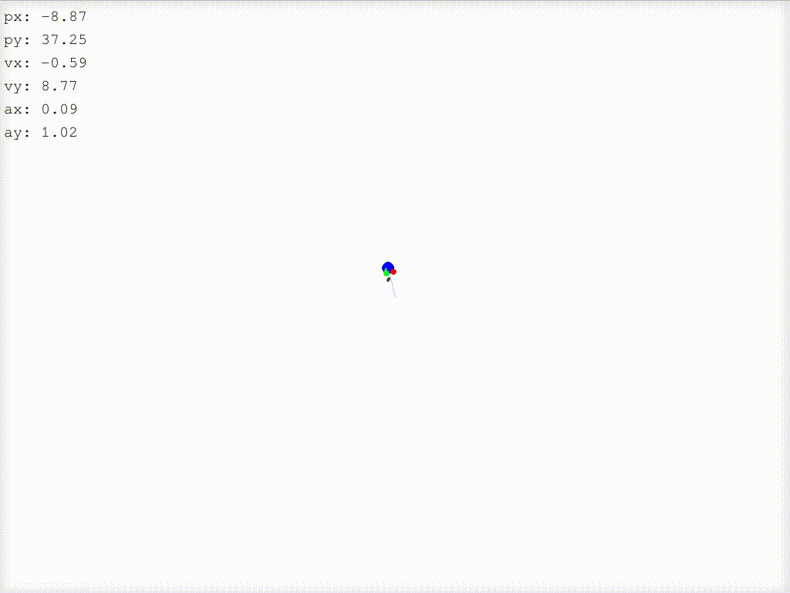

# Kalman filter in 2d simulation

With some help of ChatGPT



## installation

Requires [Conda](https://anaconda.org/anaconda/conda)

```shell
# create the new Conda environment with Python and Poetry
make env-init

# install the packages with Poetry
make env-create
```

## run

```shell
# run the simulation
make run
```

Use the keys:
- the arrow keys to increase/decrease acceleration of the object
- `r` to reset the object to the initial position
- `s` to stop the object
- `esc` to exit

Indicators:
- real position of the object: `blue`
- noisy measurement: `red`
- estimation from the Kalman filter: `green`
- median and mean averaging: `gray`
